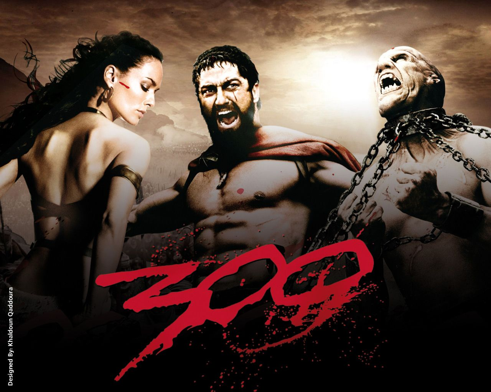

# 300
 
***
- Duración: 117 min
- Música: Tyler Bates
- Fotografía: Larry Fong
- Guion: Zack Snyder, Kurt Johnstad, Michael B. Gordon (N.: Frank Miller, Lynn Varley)
- Dirección: Zack Snyder
- Intérpretes: Gerard Butler (Rey Leónidas), Lena Headey (Reina Gorgo), Dominic West (Theron), David Wenham (Dilios), Vincent Regan (Capitán Artemis), Michael Fassbender (Stelios), Tom Wisdom (Astinos), Andrew Pleavin (Daxos), Andrew Tiernan (Ephialtes), Rodrigo Santoro (Rey Jerjes), Giovanni Antonio Cimmino (Pleistarchos), Kelly Craig (Pythia). 
***
#Resumen
***
Leónidas, al igual que el resto de niños espartanos es separado desde muy pequeño de su madre, para ser entrenado para combatir, tras lo cual estará sobradamente preparado para asumir el trono de su país.

A finales del siglo V a.C. el imperio persa, con el Emperador Jerjes al mando de un potente ejército, va anexionando país tras país y envía a uno de sus emisarios, cargado con las cabezas de todos los reyes derrocados a pedir a Leónidas tierra y agua: prueba de su sumisión. En vez de eso Leónidas acaba con el emisario y decide enfrentarse a Jerjes.

Pero para declarar la guerra necesita la aprobación de los Séforos, las autoridades religiosas que, comprados por los persas deniegan el permiso.

Al no poder declarar la guerra Leónidas se pone al frente de 300 espartanos, todos ellos con descendencia, afirmando que es su guardia personal, y parte hacia las Termópilas donde cree que podrá derrotar a Jerjes pese a su superioridad gracias al estrecho desfiladero.

Se unirán a ellos los arcadios y Efialtes, un espartano deforme al que su padre entrenó como guerrero, pero al que Leónidas rechaza por no poder defender a sus compañeros.

Al llegar a la playa una tremenda tormenta destruye una parte de la flota persa contra las rocas y los espartanos utilizarán los cadáveres para levantar un muro contra el que se lanzan los persas que son retenidos y empujados hasta un acantilado donde caen cientos, aunque entonces lanzan una nube de flechas sobre ellos, que se cubren con sus escudos, apareciendo posteriormente la caballería, que también es derrotada.

Tras su derrota Jerjes le propone a Leónidas convertirle en rey de toda Grecia si se postra a sus pies, lo que es rechazado, por lo que Jerjes lanza contra ellos a su guardia personal, los "inmortales", frente a los cuales los espartanos lanzan una montaña de cadáveres para después derrotarlos, con la ayuda de los arcadios, y pese a que los persas cuentan con un monstruoso gigante, al que Leónidas mata cortándole la cabeza.

Tampoco tendrán efecto sus trucos de magia ni sus enormes, pero torpes animales, aunque morirá en la batalla el joven Astinos, hijo del capitán de los espartanos.

Jerjes recurre a Efialtes y le ofrece todo tipo de placeres y riqueza a cambio de que les guíe a través de las montañas para sorprender a los espartanos por la retaguardia.

Entre tanto, en Esparta la reina se entrega a Theron para conseguir que influya a su favor ante el consejo y que este permita enviar refuerzos, aunque Theron, en vez de interceder a su favor la ridiculiza exponiendo su adulterio, ante lo que ella reacciona clavándole una espada y poniendo al descubierto su traición.

Conocedores de la traición de Efialtes, los arcadios deciden retirarse y Leónidas envía a Dillios para contar su gesta y que hable ante el consejo.

Rodeados por los persas, Jerjes intenta humillar a Leónidas forzándolo a rendirse, proponiéndolo de nuevo ser caudillo de toda Grecia a cambio de arrodillarse ante él. Y Leónidas, arroja su casco, su escudo y su lanza y se arrodilla, pero para después levantarse con más fuerza y arrojar su lanza al propio Jerjes, desfigurando su rostro.

Tras ello todos los espartanos mueren.

Pero Dillios cuenta su gesta al consejo para tras ello encabezar un potente ejército de espartanos y del 
resto de griegos que se enfrentarán a Jerjes por la libertad.

